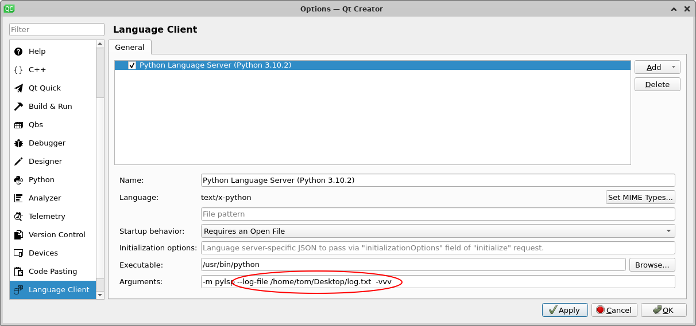

## QtCreator Install
Download the QtCreator installer package, run ```chmod +x``` on it and then run it.

## Ignore Specific Linting Warnings
```
nano ~/.config/pycodestyle

```

And add:
```
[pycodestyle]
ignore = E221, E226, E501, E722, W504
max-line-length = 100

```


