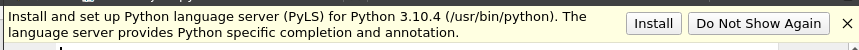
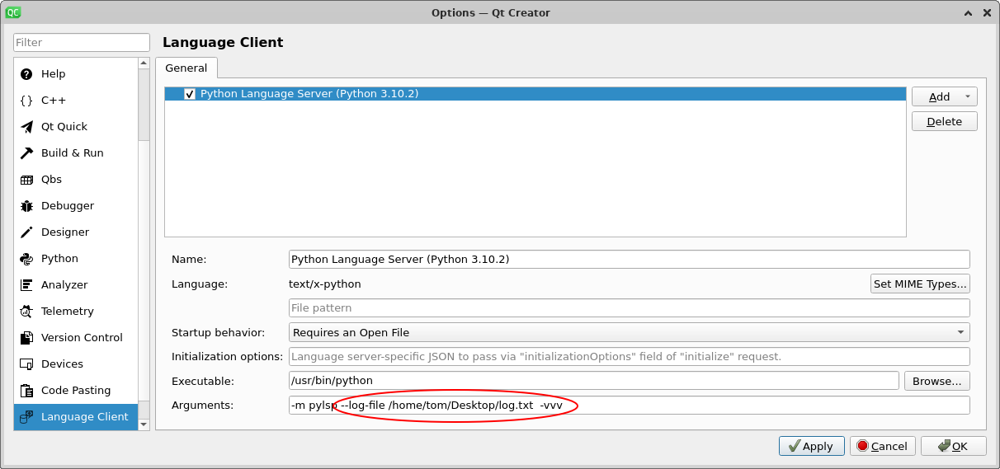

# Configuring Python In Qt Creator

## Install
In Qt Creator open a python file and it will give you the option to install PyLSP.



## Turn Logs On
If you are trying to turn warnings on and off its useful to be able to access the logs from PyLSP.



## Configure
You can configure what warnings are enabled.

```
touch ~/.config/pycodestyle

```
```
[pycodestyle]
ignore = E221, E226, E501, E722, W504
max-line-length = 100

```


